<!-- HEADER BANNER -->

  

<!-- TYPING TEXT -->

 

<!-- SOCIAL LINKS -->

 

<!-- ABOUT ME -->

<h2 align="center">💫 About Me</h2>

🟣 📊 Interested in Data Analytics & Data Science

🟣 🐍 Learning and working with Python

🟣 💬 Ask me about SQL, machine learning, Data Visualization, Power BI

🟣 ⚡ Fun fact: I believe every project is an opportunity to learn something new.

🟣 📫 Reach me at bhondavedisha9011@gmail.com

## 🛠️ Tech Stack

### 💻 Languages

### 📊 Data Analytics & Visualization

### 🤖 Machine Learning & AI

### 🗄️ Database & Cloud

### 🧰 Tools & Development

## 📊 GitHub Stats

## 🐍 Contribution Snake

<picture>
  <source media="(prefers-color-scheme: dark)" srcset="https://raw.githubusercontent.com/disha24ds/disha24ds/output/github-snake-dark.svg">
  <source media="(prefers-color-scheme: light)" srcset="https://raw.githubusercontent.com/disha24ds/disha24ds/output/github-snake.svg">
  
</picture>

